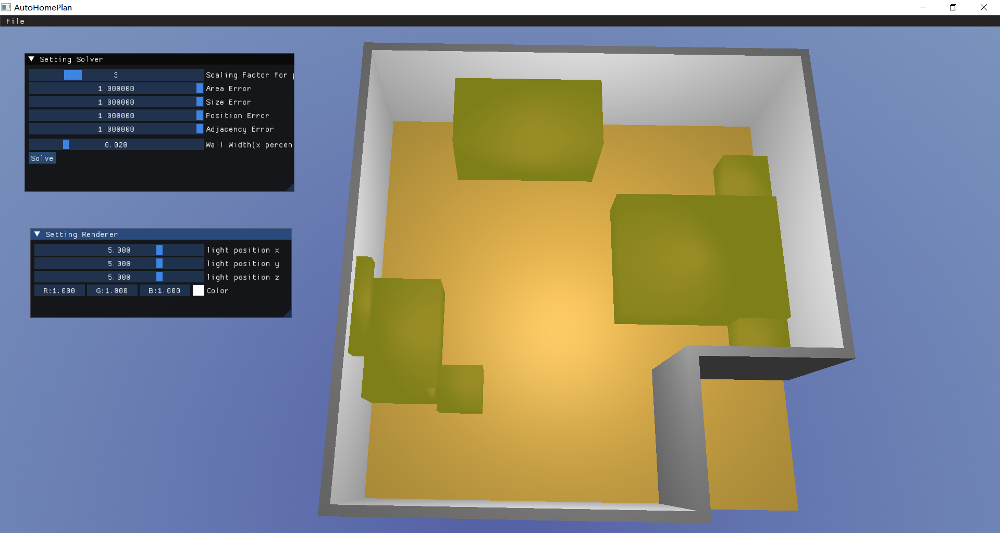

# AutoHomePlan

**This is my graduation project for USTC2024.**

<div style="text-align: center; font-size: 20px; font-weight: bold;">
Abstract
</div>

Constraint-based 3D scene layout generation: Using large language models and the Gurobi solver to model floor plan generation and interior layout design as a mixed-integer quadratic programming problem with scene graphs as input.


Current Result(The program provides a simple preview and visualization, and we will use software like Blender to achieve more detailed visualizations in the future.):





## Getting Started

AutoHomePlan utilizes CMake for project file generation, vcpkg for managing external dependencies.

### 1. Install Gurobi
Please ensure that you have installed Gurobi and set the system environment variable GUROBI_HOME. Visit website [Gurobi](https://www.gurobi.com/) for more detailed information.


Once GUROBI is successfully installed and the environment variables are correctly set, the FindGUROBI.cmake file will automatically link and configure gurobi.

### 2. Clone

```
git clone https://github.com/iambrc/AutoHomePlan.git
git submodule update --init --recursive
```
### 3. Build

First, use vcpkg to install the dependencies. After vcpkg installation is complete, you will see a vcpkg_installed folder under the project directory, containing CMake configuration files and other related content.
```
vcpkg install
```

Generating project files is straightforward:
```
cmake -DCMAKE_TOOLCHAIN_FILE="vcpkg/scripts/buildsystems/vcpkg.cmake" -DVCPKG_APPLOCAL_DEPS=ON -DCMAKE_BUILD_TYPE=Release -B build\Release -S .
cmake --build build/Release --config Release
```
You can also change *Release* to *Debug*.


### 4.Visualization of scene graphs

Here, we use [Graphviz](https://graphviz.org/) to visualize the scene graph. You can install Graphviz and add it to environment variable PATH.

The dot files are stored in the [Asset/SceneGraph](Assets/SceneGraph) folder. You can run the following code to obtain the scene graph:

```
dot -Tpng input.dot -o output.png
```


## Assets
3D assets are from [Free3D](https://free3d.com/). 

**The visualization of 3D assets has not yet been implemented. We use a rectangular prism to represent the bounding box of the object.**

## Other Information
TODO

## Acknowledgement
The framework of this project partially references [2024 Computer Graphics course assignment](https://github.com/USTC-CG/USTC_CG_24) and [Learn OpenGL](https://learnopengl-cn.github.io/intro/).
